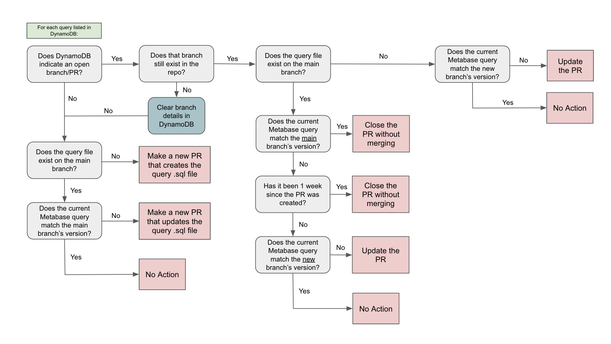

Reports from database queries often contain important business logic and data engineers and scientists need a forum to review and discuss changes with stakeholders. At the same time, analytics teams resist introducing any review process that will impede quick data exploration. This repo implements a middle ground: scheduled, after-the-fact version control for all changes that occurred on specified queries.

This repo uses the following resources:
- [Metabase](https://www.metabase.com/docs/latest/api-documentation) as the query engine
- [Gitlab](https://docs.gitlab.com/ee/api/rest/index.html) for the repo and version control
  - The code expects a directory at the path `mb/queries/` to store the .sql files
- AWS as the host:
  - [Lambda](https://docs.aws.amazon.com/lambda/latest/dg/welcome.html) as the serverless function
  - [DynamoDB](https://docs.aws.amazon.com/amazondynamodb/latest/developerguide/Introduction.html) to store the list of tracked queries
  - [EventBridge](https://docs.aws.amazon.com/eventbridge/) to schedule the execution (e.g. daily at 8AM) 
- [Docker](https://docs.docker.com/) to create the function container
- [Slack](https://api.slack.com/) to notify your team of changes to queries

Set the following environment variables:
- `DYNAMODBTABLENAME`: The name of your DynamoDB table
- `GITLABTOKEN`: Your Gitlab Account Token
- `SLACKMETABASETOKEN`: Your Slack App Token
- `MB_SLACK_CHANNEL`: The ID of the Slack channel that you will use to alert to query updates (e.g. #eng-data-ops)
- `MB_SESSION`: Your Metabase session ID (The script will reset this periodically)
- `MB_LOGIN_USERNAME`: The Metabase username you use to login when the session expires
- `MB_LOGIN_PASSWORD`: The Metabase password you use to login when the session expires

The code will search the Metabase API for any queries for any new queries with the tag `<<VERSION CONTROL>>` anywhere in the query string (most likely in a comment), and add each new query as a record in the DynamoDB table. Then the script will loop through the query records and check each current Metabase query against the query on the main branch (if it is already storing the query) and a branch from an existing (if any):

9 Different Cases:
- Case 1: No open PR and no .sql file on the main branch:
  - Create a new PR to add the Metabase query to the repo as a new file
- Case 2: No open PR and the .sql file on the main branch does not match the current Metabase query
  - Create a new PR to update the file
- Case 3: No open PR and the .sql file on the main branch matches the current Metabase query
  - No action
- Case 4: There is an open PR, but the current query on Metabase matches the .sql file on main
  - Close the PR without merging
- Case 5: There is an open PR, but the PR has been open for more than a week
  - Close the PR without merging
- Case 6: The open PR matches neither the .sql file on the main branch nor the new branch
  - Update the PR to reflect the new query in Metabase
- Case 7: The current Metabase query matches the .sql file in the open PR
  - No action
- Case 8: The current Metabase query is not on main and does not match the .sql file in the new branch
  - Update the PR to reflect the new query in Metabase
- Case 9: The current Metabase query is not on main and it matches the .sql file in the new branch
  - No action

